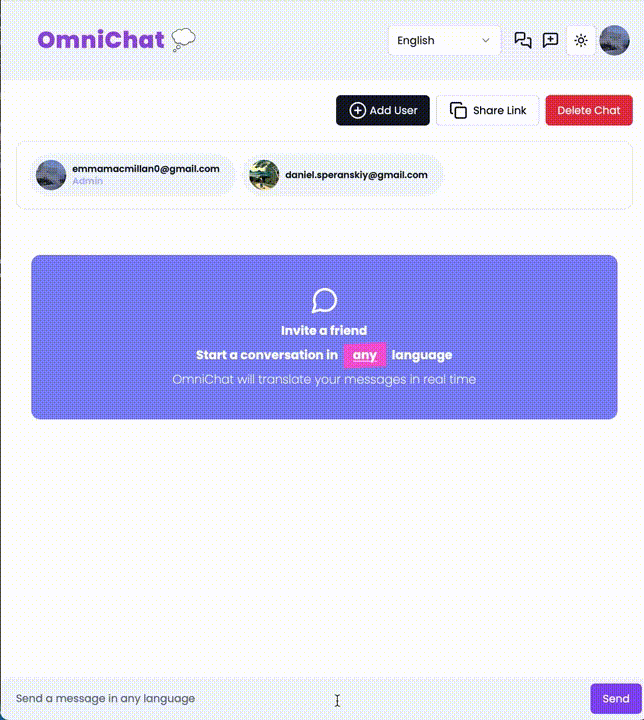

# OmniChat

Welcome to OmniChat, where innovation meets communication! OmniChat is more than just a chat platform; it's a vibrant ecosystem designed to elevate your conversations. Seamlessly translating messages in real-time, securing payments with Stripe, and providing a visually stunning interface – OmniChat is your gateway to a new era of chatting experiences. Explore the future of communication with OmniChat today! 🌐🚀

## Key Features

-   **Real-Time Translation with Firebase Extension**
    
    -   Immerse yourself in a multilingual environment with the 'Translate Text in Firestore' Firebase Extension. Watch as user messages are dynamically translated in real-time, fostering a truly global and inclusive chat experience.
-   **Firebase v9 Integration**
    
    -   Explore the robust capabilities of Firebase v9, where the Firestore Database and Firebase Authentication seamlessly come together to form the backbone of a scalable and secure backend infrastructure.
-   **Stripe Checkout Sessions**
    
    -   Elevate your chatting experience with seamless payments using Stripe Checkout Sessions. Subscribe users effortlessly, providing a secure and streamlined payment process directly within the OmniChat platform.
-   **Stripe Webhooks and Firestore Integration**
    
    -   Dive into the intricacies of Stripe Webhooks, dynamically updating the Firestore database in response to Stripe events. Ensure data consistency and reliability as you stay in control of your chat data.
-   **UI/UX Design with Shadcn**
    
    -   Immerse yourself in a visually stunning interface, carefully crafted with the popular Shadcn library. Tailored specifically for SaaS platform development, Shadcn enhances user experience and engagement in OmniChat.
-   **Form Validation with Zod**
    
    -   Ensure a smooth chatting experience with robust form validation powered by Zod. Type safety and error reduction are at the forefront, providing users with a seamless interaction.
-   **Global State Management with Zustand**
    
    -   Power up your OmniChat experience with efficient global state management using Zustand. Enhance scalability and maintainability while delivering a responsive and dynamic chatting environment.
-   **NextAuth Middleware for Authentication**
    
    -   Safeguard your chats with NextAuth middleware, protecting page routes and API routes. Enjoy a secure authentication flow that enhances user confidence within OmniChat.
-   **Firebase Rules for Database Security**
    
    -   Implement Firebase Rules to fortify your Firestore Database. Protect sensitive user data and adhere to the highest security standards, ensuring a secure communication space.
-   **Login and Logout Authentication Flow**
    
    -   Craft a seamless login and logout experience using NextAuth on Next.js 13. Elevate user security and overall satisfaction, making every interaction within OmniChat a trustworthy one.
-   **Skeleton Loaders for Data Loading**
    
    -   Immerse your users in a delightful chatting experience with skeleton loaders. Ensure a smooth and visually appealing loading experience while data is fetched in the background.
-   **Custom Hooks for Code Simplification**
    
    -   Simplify and modularize your OmniChat codebase with custom hooks. Promote code reusability and maintainability, making development and future enhancements a breeze.
-   **SaaS Platform with Tailwind CSS**
    
    -   Marvel at the beauty of OmniChat with a stunning SaaS platform designed using Tailwind CSS. Enjoy a responsive and aesthetically pleasing design that complements the innovative chatting experience.
-   **Dark Mode Toggling**
    
    -   Personalize your OmniChat experience with dark mode toggling. Update the UI based on user preference, enhancing accessibility and allowing users to customize their chatting environment.
-   **TypeScript for Bug Reduction**
    
    -   Embrace the power of TypeScript to reduce bugs and errors in the OmniChat codebase. Ensure a more robust and maintainable chatting application that stands the test of time.
-   **Deployment on Vercel**
    
    -   Conclude your OmniChat journey with a deep dive into deployment on Vercel. Explore a seamless and scalable hosting solution, ensuring that OmniChat is accessible to users far and wide.

## Technologies Used

OmniChat is powered by an array of cutting-edge technologies, including:

-   Firebase (Firestore, Authentication)
-   Stripe
-   Shadcn
-   Zod
-   Zustand
-   NextAuth
-   Tailwind CSS
-   TypeScript
-   Vercel

As you immerse yourself in OmniChat, you're not just exploring a chat platform – you're unlocking a realm of possibilities for communication, collaboration, and connection. Dive in, explore, and let OmniChat redefine the way you chat. 🚀